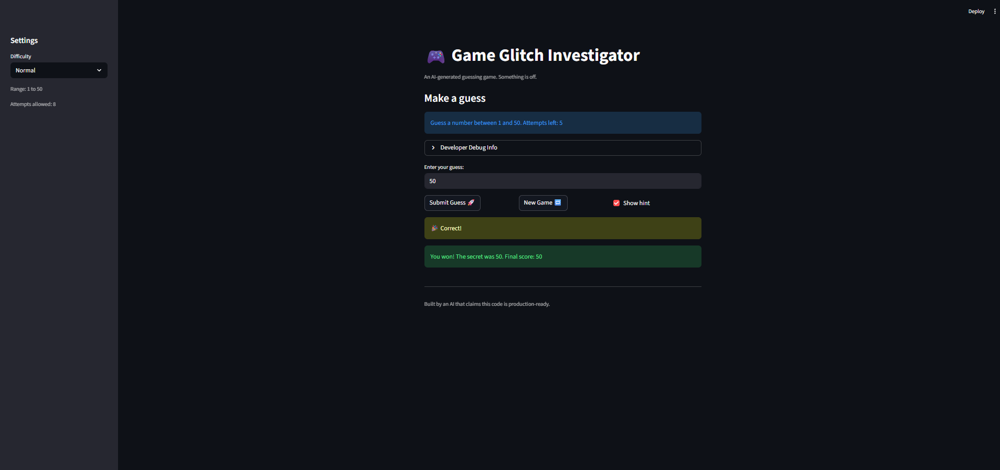

# 🎮 Game Glitch Investigator: The Impossible Guesser

## 🚨 The Situation

You asked an AI to build a simple "Number Guessing Game" using Streamlit.
It wrote the code, ran away, and now the game is unplayable. 

- You can't win.
- The hints lie to you.
- The secret number seems to have commitment issues.

## 🛠️ Setup

1. Install dependencies: `pip install -r requirements.txt`
2. Run the broken app: `python -m streamlit run app.py`

## 🕵️‍♂️ Your Mission

1. **Play the game.** Open the "Developer Debug Info" tab in the app to see the secret number. Try to win.
2. **Find the State Bug.** Why does the secret number change every time you click "Submit"? Ask ChatGPT: *"How do I keep a variable from resetting in Streamlit when I click a button?"*
3. **Fix the Logic.** The hints ("Higher/Lower") are wrong. Fix them.
4. **Refactor & Test.** - Move the logic into `logic_utils.py`.
   - Run `pytest` in your terminal.
   - Keep fixing until all tests pass!

## 📝 Document Your Experience

- [x] **Game purpose:** A number guessing game where the player tries to guess a secret number within a limited number of attempts. After each guess, the game gives a "Go Higher" or "Go Lower" hint to guide the player toward the answer. Three difficulty levels (Easy, Normal, Hard) control the number range and attempt limit.

- [x] **Bugs found:**
  1. **Backwards hints**: when the guess was too high, the game said "Go HIGHER!", and vice versa.
  2. **Type mismatch on even attempts**: on every even-numbered attempt, the secret number was cast to a string, causing comparisons to use lexicographic ordering (e.g. `"9" > "10"` is `True`) and breaking both hints and the win check.
  3. **Restart was broken**: clicking "New Game" reset the attempts and secret but never reset `status`. Since `status` stayed `"won"` or `"lost"`, the app hit `st.stop()` on every rerun and the new game could never be played.
  4. **Hardcoded range in info message**: the hint bar always displayed "between 1 and 100" regardless of the selected difficulty.

- [x] **Fixes applied:**
  1. Swapped the hint text and emojis in `check_guess()` so "Too High" maps to "Go LOWER!" and "Too Low" maps to "Go HIGHER!".
  2. Removed the `if attempts % 2 == 0` branch that converted the secret to a string; the secret is now always passed as an integer.
  3. Added `st.session_state.status = "playing"`, `score = 0`, and `history = []` resets inside the `new_game` block, and fixed the hardcoded `random.randint(1, 100)` to use the difficulty-based `low`/`high` range.
  4. Replaced the hardcoded `"1 and 100"` in `st.info(...)` with `f"{low} and {high}"` so it reflects the active difficulty.

## 📸 Demo

## 🚀 Stretch Features

- [ ] [If you choose to complete Challenge 4, insert a screenshot of your Enhanced Game UI here]
